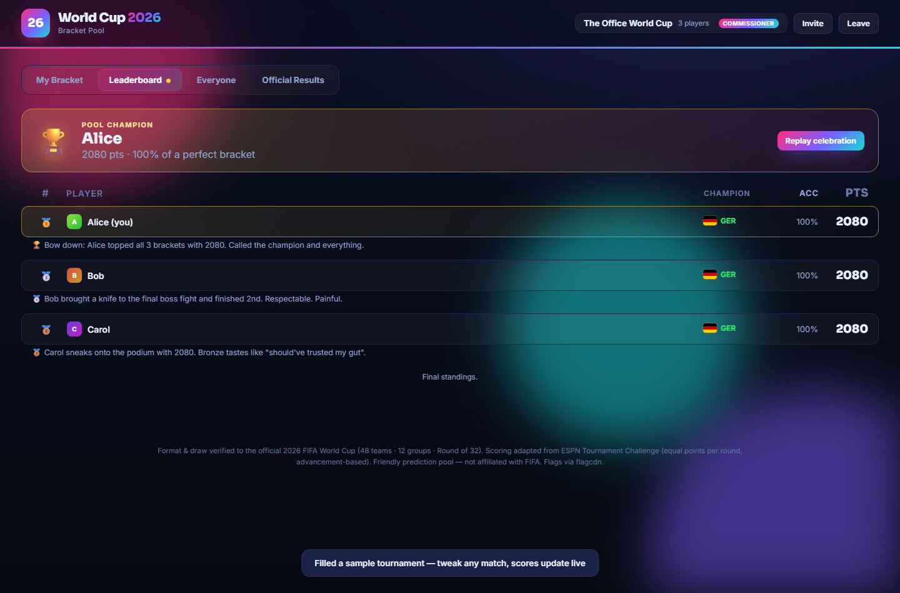

# 2026 FIFA World Cup — Bracket Pool

Predict all 48 teams from the group stage to the Final, invite your friends to a
private pool, and battle up a live leaderboard. Nobody can see anyone else's picks
until the first match kicks off. When the tournament ends, the points winner gets an
elaborate celebration and **everyone** gets a cheeky, performance-based roast.



## Run it

A tiny full-stack app — Node/Express + a JSON datastore. No database to install.

```
npm install
npm start
```

Then open **http://localhost:3000**. Create a pool, copy the invite link, and send it
to friends (on the same network, or deploy anywhere that runs Node).

> Online is recommended — country flags load from a CDN (flagcdn). Offline, they fall
> back to country-code badges and everything else still works.

## How a pool works

1. **Create a pool** — you become the commissioner. Share the invite link.
2. **Everyone fills a bracket** — rank all 12 groups, choose the 8 best third-placed
   teams, pick every knockout winner to the Final, and set a tiebreaker (total goals
   in the Final). Drafts auto-save.
3. **Submit to lock** — your picks are sealed. **Privacy:** nobody (not even the
   commissioner) can see anyone's bracket until kickoff.
4. **Kickoff** — at the first match (the commissioner sets the time, or hits
   "Start tournament now"), all brackets lock and become visible.
5. **Live leaderboard** — the commissioner enters official results as games play out;
   scores update live. Correct picks light their bracket lines **bright green**.
6. **Finale** — when the champion is decided, the points leader gets a confetti
   celebration and every player gets a cheeky roast for all to see.

## Scoring (ESPN Tournament Challenge model)

Researched from ESPN's official rules and adapted to the World Cup's format. ESPN's
signature principle — **every round is worth the same in total** — is preserved, using
the **advancement model** (you score for a team you picked to reach a round that
actually reaches it; set-intersection, path-independent).

| Source | Points | Available |
|---|---|---|
| Group advancers (top-2 per group, unordered) | 10 each | 24 → 240 |
| Best-third qualifiers | 10 each | 8 → 80 |
| Round of 32 | 20 each | 16 → 320 |
| Round of 16 | 40 each | 8 → 320 |
| Quarter-finals | 80 each | 4 → 320 |
| Semi-finals | 160 each | 2 → 320 |
| Final (champion) | 320 | 1 → 320 |
| Champion bonus | 160 | → 160 |
| **Maximum** | | **2080** |

**Tiebreaker:** closest predicted total goals in the Final, then late-round accuracy,
then earliest submission. No upset bonus (matches classic ESPN).

## Accuracy

The tournament data is the real 2026 World Cup: 48 teams, the official final draw
(5 Dec 2025) with all six play-off winners resolved (BIH, SWE, TUR, CZE via UEFA;
IRQ, COD via the intercontinental play-offs), top-2-per-group + 8 best thirds, and the
official Round of 32 → Final bracket (matches 73–104). Third-placed teams are slotted so
no side ever meets a group rival — verified valid for all 495 qualifying combinations.

## Project layout

```
server.js              Express API + static host
db.js                  atomic JSON datastore (data/)  [env: WC_DATA_DIR]
public/
  index.html           shell
  styles.css           theme, bracket, pool UI
  api.js               API client + per-pool identity
  bracket.js           BracketUI — group/thirds/knockout rendering (edit/view/official)
  app.js               screens, routing, leaderboard, finale
  shared/
    data.js            48 teams, 12 groups, knockout graph  (Node + browser)
    engine.js          scoring, resolution, green-line correctness, roasts  (Node + browser)
tasks/                 plan + automated tests
```

## Tests

```
npm test          # 152 checks: data integrity + all 495 third combos (check.js),
                  #   scoring engine (engine-check.js), HTTP API lifecycle (api-check.js)
npm run e2e       # real-Chrome multi-user run: 3 players create/join/submit, privacy,
                  #   reveal, official results, live leaderboard, finale (shots.js)
```

The API & engine are server-authoritative; the same `shared/` logic runs in the browser
for display. Privacy is enforced on the server (other players' picks are never sent
before kickoff), not just hidden in the UI.

*Friendly prediction pool — not affiliated with FIFA or ESPN. Flags via flagcdn.com.*
